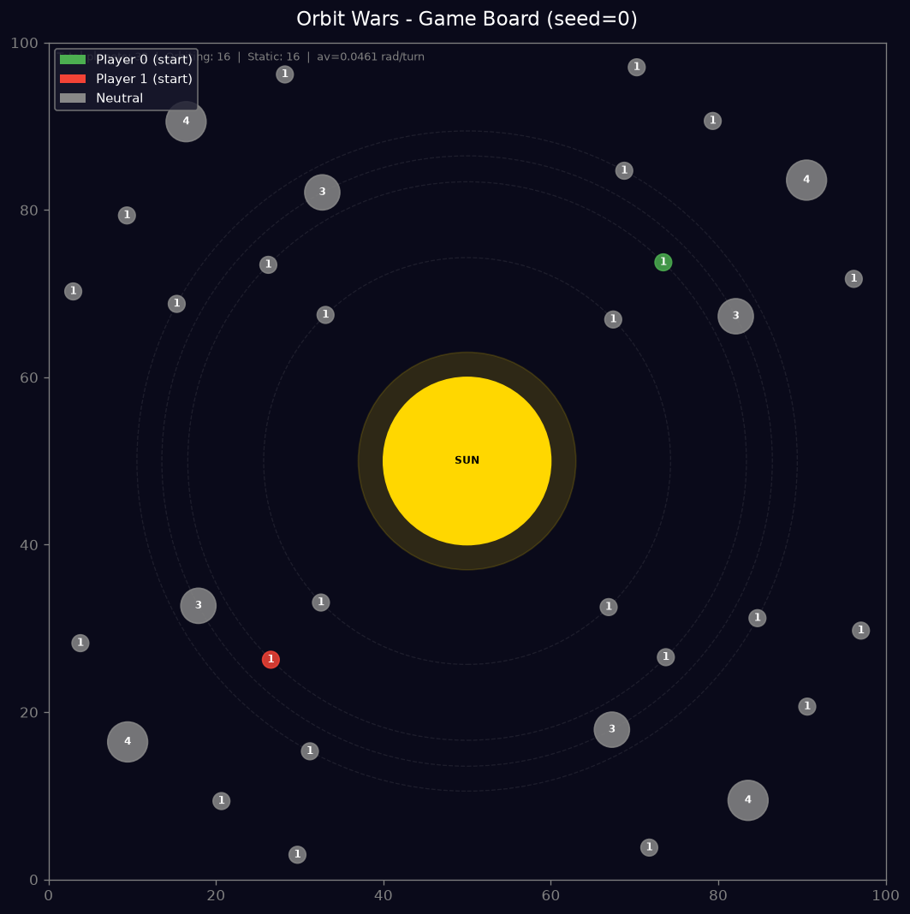
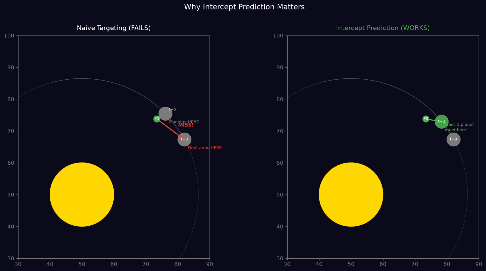
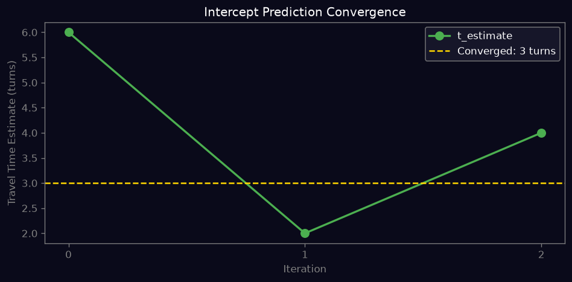
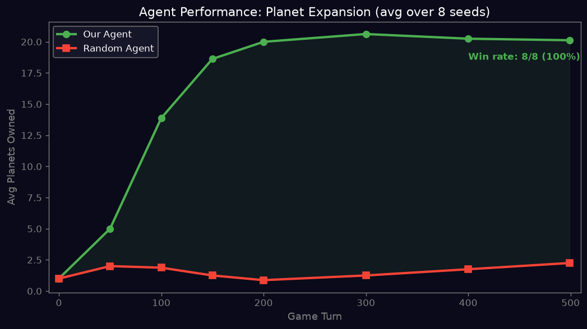
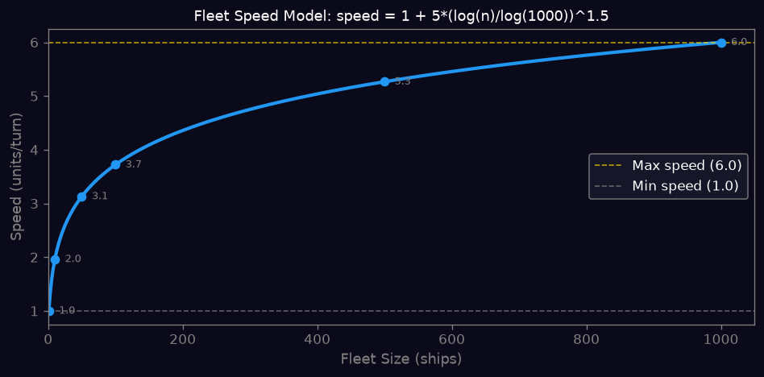

# Orbit Wars Agent
A competitive game AI agent for the [Kaggle Orbit Wars](https://www.kaggle.com/competitions/orbit-wars) competition, a real-time strategy game where players capture planets orbiting a sun in continuous 2D space.
**Competition:** 2,174 teams | 50,000 USD prize pool
---
## Game Board

## The Core Problem: Why Naive Targeting Fails
Planets orbit the sun, so a naive agent that aims at the current planet position will always miss.

## Key Algorithm: Iterative Intercept Prediction
The main insight is treating fleet targeting as an **intercept problem**, not a pursuit problem.
**Naive approach (fails):**
    target_x, target_y = planet.current_x, planet.current_y  # planet has moved!
**Correct approach:**
    def predict_intercept(sx, sy, target, step, initial_planets, av, n_ships):
        t_est = travel_time(sx, sy, target.current_pos, n_ships)
        for _ in range(15):
            future_pos = get_planet_position(target, step + t_est)
            new_t = travel_time(sx, sy, future_pos, n_ships)
            if abs(new_t - t_est) <= 1:
                break
            t_est = new_t
        return future_pos
This solves the circular dependency between travel time and target position. Converges in 3-5 iterations.

## Agent Performance vs Random Baseline

## Fleet Speed Model
Speed scales logarithmically with fleet size (1 ship = 1.0 units/turn, max 6.0).

## Other Features
- **Sun avoidance:** detects and reroutes fleets that would cross the sun
- **Continuous collision detection:** matches the engine segment-based collision model
- **Greedy expansion:** scores targets by production * turns_remaining / (garrison + distance)
- **Defense:** intercepts incoming enemy fleets before they reach owned planets
## Tech Stack
- Python 3.12
- [kaggle-environments](https://github.com/Kaggle/kaggle-environments)
## Usage
    pip install kaggle-environments
    python test.py
## What I Learned
- Game AI requires predicting future state, not reacting to current state
- Iterative numerical methods handle moving-target problems better than closed-form solutions
- Reading the game engine source code is essential, documentation alone is not enough
- Elo-based leaderboards require many games to calibrate
